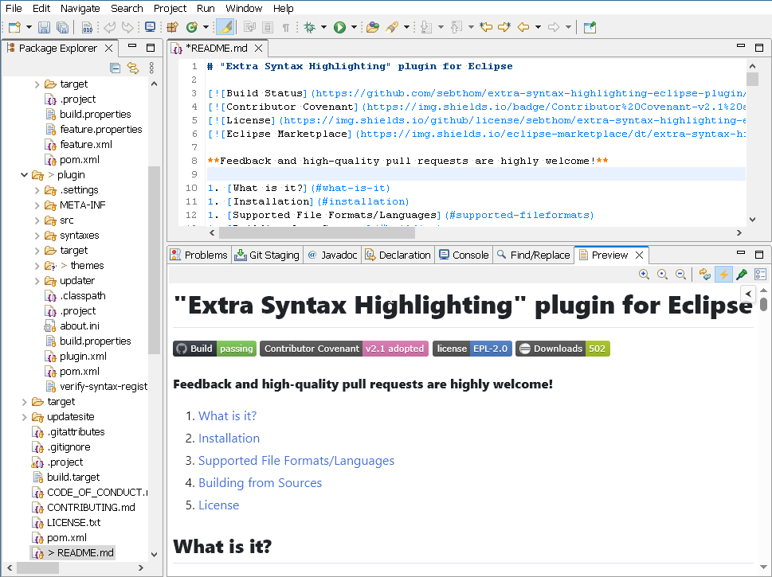
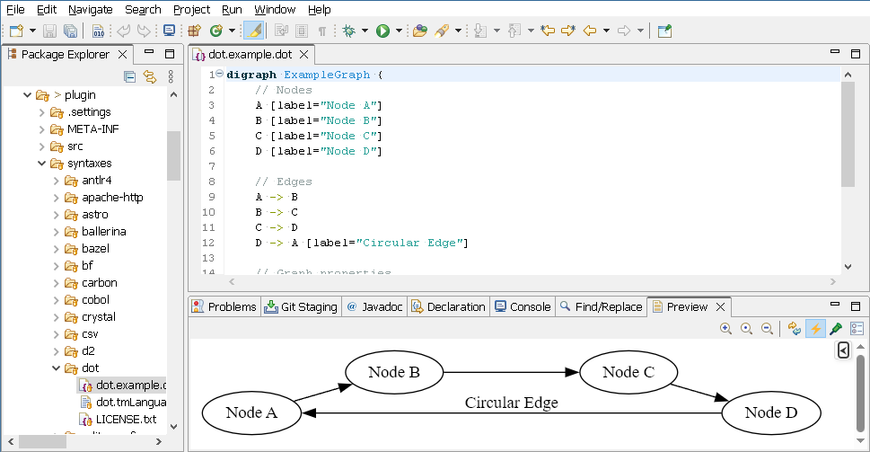

# previewer-eclipse-plugin

[](https://github.com/sebthom/previewer-eclipse-plugin/actions/workflows/build.yml)
[](CODE_OF_CONDUCT.md)
[](LICENSE.txt)
[](https://marketplace.eclipse.org/content/previewer-plugin)


**Feedback and high-quality pull requests are  highly welcome!**

1. [What is it?](#what-is-it)
1. [Installation](#installation)
1. [Adding support for other formats](#extending)
1. [Building from Sources](#building)
1. [Acknowledgement](#acknowledgement)
1. [License](#license)


## <a name="what-is-it"></a>What is it?

This **extensible** [EclipseⓇ](https://eclipse.org) plugin contributes a new **Preview** view that displays rendered versions of files
opened in text editors.

The following formats are supported out of the box:
- [Draw.io](https://www.drawio.com/) diagrams
- [GitHub flavored Markdown (GFM)](https://github.github.com/gfm/)
- GraphViz [DOT](https://graphviz.org/doc/info/lang.html) diagrams
- HTML
- [Mermaid](https://mermaid.js.org/) diagrams
- [PlantUML](https://plantuml.com/) diagrams
- [Scalable Vector Graphics (SVG)](https://en.wikipedia.org/wiki/SVG)
- Terrastruct [D2](https://d2lang.com/) diagrams (requires `d2` executable from https://github.com/terrastruct/d2/releases installed locally)
- TextMate grammars (requires the [Eclipse TM4E](https://github.com/eclipse-tm4e/tm4e) plugin)

This plugin is best used together with the [TM4E incl. Language Pack](https://github.com/eclipse/tm4e)
and [Extra Syntax Highlighting Plugin](https://github.com/sebthom/extra-syntax-highlighting-eclipse-plugin)
which provide syntax highlighting for the supported source files.

- Markdown example:

  

- GraphViz example:

  


## <a name="installation"></a>Installation

To install the plugin into an existing Eclipse installation do:
1. Within Eclipse go to: Help -> Install New Software...
1. Enter the following update site URL: https://raw.githubusercontent.com/sebthom/previewer-eclipse-plugin/updatesite
1. Select the `Previewer` feature to install.
1. Ensure that the option `Contact all update sites during install to find required software` is enabled.
1. Click `Next` twice.
1. Read/accept the license terms and click `Finish`.
1. Eclipse will now download the necessary files in the background.
1. When the download has finished, Eclipse will ask about installing unsigned content. You need to accept if you want to
1. After installation you will be prompted for a restart of Eclipse, which is recommended.


## <a id="extending"></a>Adding support for other formats

The plugin provides extension points that allow registration of additional renderers to support more file formats.
If you are new to Eclipse plugin development please consult https://github.com/eclipse-platform/eclipse.platform/blob/master/docs/FAQ/FAQ_What_are_extensions_and_extension_points.md
for more details about extension points.

1. The `htmlPreviewerRenderer` extension point allows to register classes implementing [de.sebthom.eclipse.previewer.api.HtmlPreviewRenderer](plugin/src/main/java/de/sebthom/eclipse/previewer/api/HtmlPreviewRenderer.java):
   HtmlPreviewRenderer are used to render source files to a HTML representation. The renderer plugin display the generated HTML inside managed browser component.
   ```xml
   <extension point="de.sebthom.eclipse.previewer.renderers">
      <htmlPreviewRenderer class="com.example.ConfigHtmlPreviewRenderer" file-extensions="cfg,ini" file-pattern="**/.cfg/_config_rc" file-names="CONFIG_RC" />
   </extension>
   ```

1. The `previewerRenderer` extension point allows to register classes implementing [de.sebthom.eclipse.previewer.api.PreviewRenderer](plugin/src/main/java/de/sebthom/eclipse/previewer/api/PreviewRenderer.java):
   If rendering to HTML is not desirable or possible PreviewRenderers can be used to render source files onto an SWT Composite managed by the renderer itself.
   ```xml
   <extension point="de.sebthom.eclipse.previewer.renderers">
      <previewRenderer class="com.example.ConfigPreviewRenderer" file-extensions="cfg,ini" file-pattern="**/.cfg/_config_rc" file-names="CONFIG_RC" />
   </extension>
   ```

## <a id="building"></a>Building from Sources

To ensure reproducible builds this Maven project inherits from the [vegardit-maven-parent](https://github.com/vegardit/vegardit-maven-parent)
project which declares fixed versions and sensible default settings for all official Maven plug-ins.

The project also uses the [maven-toolchains-plugin](http://maven.apache.org/plugins/maven-toolchains-plugin/) which decouples the JDK that is
used to execute Maven and it's plug-ins from the target JDK that is used for compilation and/or unit testing. This ensures full binary
compatibility of the compiled artifacts with the runtime library of the required target JDK.

To build the project follow these steps:

1. Download and install a Java 17 SDK, e.g. from:
   - https://adoptium.net/releases.html?variant=openjdk17
   - https://www.azul.com/downloads/?version=java-17-lts&architecture=x86-64-bit&package=jdk

1. Download and install the latest [Maven distribution](https://maven.apache.org/download.cgi).

1. In your user home directory create the file `.m2/toolchains.xml` with the following content:

   ```xml
   <?xml version="1.0" encoding="UTF8"?>
   <toolchains>
      <toolchain>
         <type>jdk</type>
         <provides>
            <version>17</version>
            <vendor>default</vendor>
         </provides>
         <configuration>
            <jdkHome>[PATH_TO_YOUR_JDK_17]</jdkHome>
         </configuration>
      </toolchain>
   </toolchains>
   ```

   Set the `[PATH_TO_YOUR_JDK_17]` parameter accordingly.

1. Checkout the code using one of the following methods:

    - `git clone https://github.com/sebthom/previewer-eclipse-plugin`
    - `svn co https://github.com/sebthom/previewer-eclipse-plugin previewer-eclipse-plugin`

1. Run `mvn clean verify` in the project root directory. This will execute compilation, unit-testing, integration-testing and
   packaging of all artifacts.


## <a name="acknowledgement"></a>Acknowledgement

**Draw.io** diagrams are rendered using https://www.draw.io/js/viewer.min.js, which is licensed under [Apache License 2.0 ](https://github.com/jgraph/drawio/blob/dev/LICENSE).

By default, **GraphViz DOT** files are rendered using a bundled version of [Viz.js](https://github.com/mdaines/viz-js), which is licensed under [MIT](https://github.com/mdaines/viz-js/blob/v3/LICENSE).

By default, **Markdown** files are rendered using a bundled version of [CommonMark Java](https://github.com/commonmark/commonmark-java), which is licensed under [BSD-2-Clause](https://github.com/commonmark/commonmark-java/blob/main/LICENSE.txt).

Rendered **Markdown** files are styled using [GitHub MarkDown CSS](https://github.com/sindresorhus/github-markdown-css/), which is licensed under [MIT](https://github.com/sindresorhus/github-markdown-css/blob/main/license).

**Mermaid** files are rendered using a bundled version of [Mermaid JS](https://github.com/mermaid-js/mermaid), which is licensed under [MIT](https://github.com/mermaid-js/mermaid/blob/develop/LICENSE).

**PlantUML** files are rendered using a bundled version of [PlantUML](https://github.com/plantuml/plantuml/), which is licensed under [MIT](https://github.com/plantuml/plantuml/blob/master/plantuml-mit/mit-license.txt)


## <a name="license"></a>License

If not otherwise specified (see below), files in this repository fall under the [Eclipse Public License 2.0](LICENSE.txt).

Individual files contain the following tag instead of the full license text:
```
SPDX-License-Identifier: EPL-2.0
```

This enables machine processing of license information based on the SPDX License Identifiers that are available here: https://spdx.org/licenses/.

An exception is made for:
1. files in readable text which contain their own license information, or
2. files in a directory containing a separate `LICENSE.txt` file, or
3. files where an accompanying file exists in the same directory with a `.LICENSE.txt` suffix added to the base-name of the original file.
   For example `foobar.js` is may be accompanied by a `foobar.LICENSE.txt` license file.
